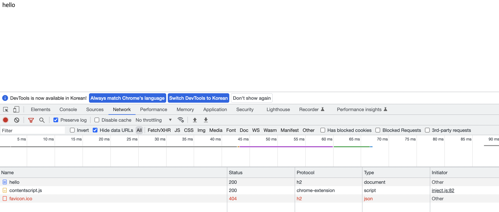

# http2

http2 학습을 위한 프로젝트

# 프로젝트 시작 방법

1. ssl 적용을 위한 keystore 파일 생성

ssl 을 적용해야 브라우저에서 http2 프로토콜을 사용할 수 있다.

```
$ cd src/resources
$ keytool -genkey -alias bns-ssl -storetype PKCS12 -keyalg RSA -keysize 2048 -keystore keystore.p12 -validity 3650
```

2. 브라우저에서 hello 페이지로 이동 후 protocol 확인

```shel
$ open https://localhost:8090/hello
```


